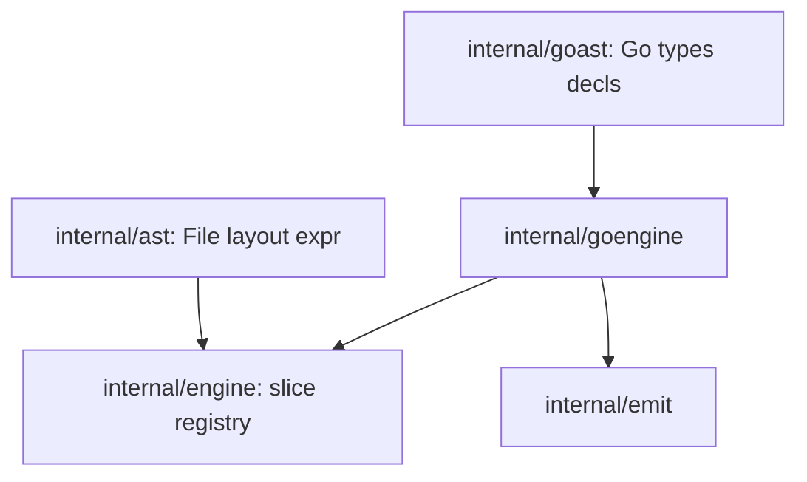

# codegen

Language-agnostic AST, dense-slice render engine, and Go code-generation backend.

## Architecture



- **ast** — Neutral nodes: `File`, layout (`BlankLine`, `LineComment`, `BlockComment`), expression sub-AST, and control-flow statements without Go type syntax.
- **goast** — Go-specific shapes: `TypeExpr`, declarations (`PackageDecl`, `FuncDecl`, …), `VarDeclStmt`, `GoDocComment`.
- **engine** — Registration-based dispatch via `[]RenderFn` indexed by `int(NodeKind)`. No maps on the hot path; no language-specific rendering.
- **goengine** — Registers all Go renderers, including `GoRenderTypeExpr` for type syntax.
- **emit** — Language-neutral indented text buffer.

## Dispatch model

`NodeKind` values are sequential integers. `EngineCreate` pre-allocates a renderer slice of length `NodeKindCount`. `EngineRenderNode` loads `registry[int(kind)]` in O(1) — a single memory offset, not a hash map.

```go
eng := gocode.GoEngineCreate()
emitter := gocode.GoEmitterCreate()
file := codegen.DeclFile(/* elements */)
_ = codegen.EngineRender(eng, &emitter, file)
```

## Usage

```go
import (
    "codegen"
    gocode "codegen/go"
)

file := codegen.DeclFile(
    gocode.GoGeneratedFileHeader("my tool", time.Now())...,
    codegen.FileElementFrom(codegen.DeclPackage("internal")),
    // ...
)

output, err := gocode.GoFileRender(file)
```

## Extending

1. Add a `NodeKind` constant and struct in `ast` or `goast` (Go-only kinds use `goast`).
2. Implement a renderer in `goengine` (or a new `internal/dslengine` package).
3. Register with `engine.EngineRegister` on your engine instance.

Override a single kind by registering after `GoEngineCreate()` on the same engine.

A future DSL backend would define its own AST package, register renderers on a fresh `engine.Engine`, and never import `goengine`.

## Reference client

`libs/splash/internal/cmd/vulkangen` builds a `codegen.File` from Vulkan command tables and renders with `gocode.GoFileRender`.
